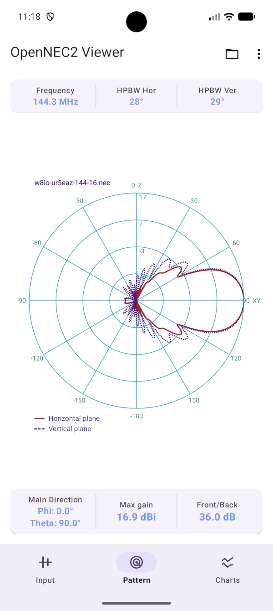

# Open NEC2 Viewer for Android

Open NEC2 Viewer is an Android app powered by the NEC2++ engine. It allows you to open *.nec model files, view 3D antenna geometry, and simulate antenna Radiation Pattern and frequency responses on your mobile device.

<p align="center">
  
</p>

## Features

- NEC2++ simulation engine
- Android Service-based simulation execution
- JSON-based result exchange
- Native C++ core via Android NDK

## Overview

```text
app/        Android UI
nec2core/   Native NEC2++ integration and simulation engine
external/   Third-party sources and libraries
```

## Build

### Requirements

- Android Studio Rabbit1 or newer
- Android SDK
- Android NDK 28.0.13004108 or newer
- CMake 3.22.1 or newer

### Clone the repository

```bash
git clone --recurse-submodules https://github.com/radioacoustick/opennec2-viewer
cd open-nec2-viewer
```

### Open in Android Studio

Open the project in Android Studio and allow Gradle to synchronize
dependencies automatically.

### Build

Build the application using:

```bash
./gradlew assembleDebug
```
or use **Build → Make Project** from Android Studio.

## License

Licensed under GPL-3.0-or-later.

See:
- LICENSE

## Third-Party Components

This project incorporates third-party software distributed with the source code
and additional dependencies obtained through Gradle.

Open NEC2 Viewer includes NEC2++ developed by Timothy C.A. Molteno.

### Citation

Timothy C.A. Molteno,
"NEC2++: An NEC-2 compatible Numerical Electromagnetics Code",
Electronics Technical Reports No. 2014-3,
ISSN 1172-496X, October 2014.

See:
- THIRD-PARTY-LICENSES.md

